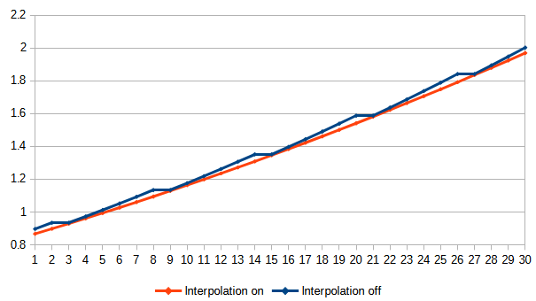
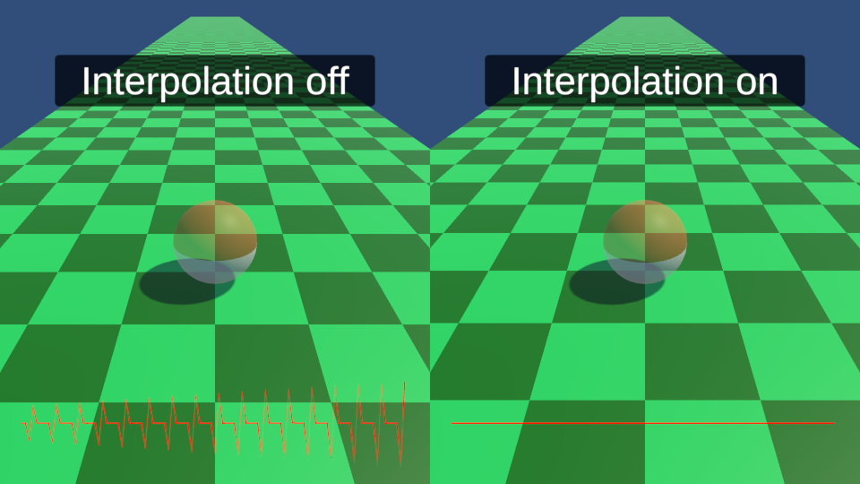

# Follow Physics

This project illustrates an issue with a camera following a Unity physics object.

## The issue

Digital Foundry highlighted this issue in a recent video:

The problem is that, by default, the Unity physics system updates at a fixed rate of 50 times per second, whereas the displayed frames usually update at a rate of approximately 60 times per second. (The actual update rate might match your monitor settings, or just go as fast as it can.)

When the displayed rate and the physics rate are different, the number of physics updates between displayed frames will vary, and this will make the scene visibly judder in play.

The following graph shows the apparent displacement of an object displayed at 60 frames per second but updating its position at 50 frames per second in blue. In orange, you can see the equivalent displacement using interpolation.

To help show what's going on, this project contains two scenes. You should build and run these scenes rather than previewing them in the editor, as editor playback has its own frame rate issues.

## Side By Side

The first scene shows a split screen with a ball rolling down a ramp. On the left, physics interpolation is off, and the issue described is visible. On the right, physics interpolation is on, and the issue goes away.

The graph at the bottom of each pane shows the acceleration of the camera object over time, where the camera is following the ball at a fixed distance and updating at approximately 60 frames per second.

In this scene, the ball has a `Rigidbody` component attached. On the left, the `Interpolate` parameter is set to `None`, which is the default setting.

On the right, the parameter is set to `Interpolate`, which fixes the issue.

It also saves out two `CSV` files capturing the displacement of the camera at each frame and the time of the frame. One with interpolation on and the other with it off.

Press the `TAB` key to switch to the next scene.

## Toggle

In the next scene, you can toggle the interpolation setting on and off by pressing the `SPACE BAR` and move the ball around with the `W` `A` `S` `D` keys. Because this movement is applied using the physics system, it exhibits the same issue.

The best way to see the difference is to give the ball a small forward force by tapping the `W` key and then toggle with the `SPACE BAR`. If you look carefully at the floor pattern, you should notice that the movement judders when interpolation is off and smooths out when it is on.